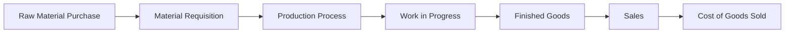

# 💰 Cost Accounting Methods for Manufacturing

In the manufacturing world, profit margins depend on one critical factor — **how accurately costs are measured and managed**.  
Cost accounting gives manufacturers the insight they need to control spending, improve efficiency, and price their products competitively.

---

## ⚙️ What is Cost Accounting?

Cost accounting is a process of **tracking, analyzing, and allocating costs** associated with production.  
It helps businesses understand the true cost of making each product, including:

- Direct materials  
- Direct labor  
- Manufacturing overhead  

This information supports smarter decisions on pricing, budgeting, and process improvement.

---

## 🧾 Types of Cost Accounting Methods

### 1️⃣ Job Order Costing
Used when products are manufactured **based on specific customer orders** or custom designs.  

- Tracks costs for each job or batch separately.  
- Ideal for small-scale or customized production.  
- Examples: machine tools, furniture, printing.

---

### 2️⃣ Process Costing
Used for **mass production** of standardized items.  

- Costs are accumulated for each process or department.  
- Average cost per unit is calculated.  
- Examples: chemicals, cement, paper, textiles.

---

### 3️⃣ Activity-Based Costing (ABC)
Focuses on **cost drivers** — activities that consume resources (e.g., machine setups, inspections).  

- Assigns overheads more accurately.  
- Ideal for complex environments with multiple products.  
- Example: electronics, automobile parts.

---

### 4️⃣ Standard Costing
Involves **comparing actual costs with pre-set standard costs** to analyze variances.  

- Helps identify inefficiencies or waste.  
- Useful for budgeting and performance control.  
- Common in repetitive manufacturing setups.

---

### 5️⃣ Marginal (Variable) Costing
Considers only **variable costs** in product costing (materials, labor, etc.).  

- Fixed costs are treated as period expenses.  
- Helps in short-term decision-making, like pricing or capacity utilization.  

---

## 🧭 Cost Flow in Manufacturing

The cost flow in a manufacturing environment typically follows this path:

